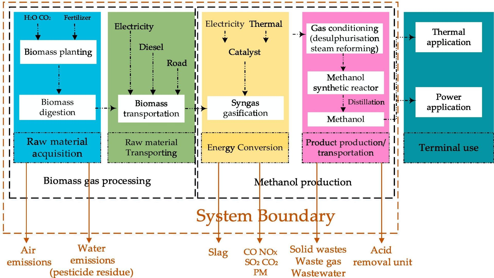
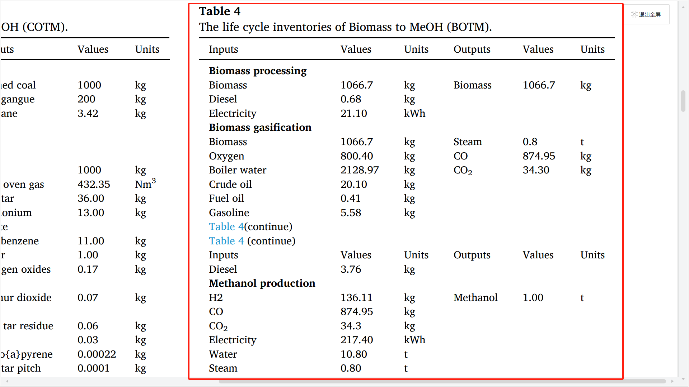

# 数据评估

数据收集指南可参考 [数据收集-数据收集说明](/docs/data-collection/data-collection-instructions.md)

本案例基于文献  [Comparative environmental assessment of methanol production technologies](https://doi.org/10.1016/j.enconman.2024.118128)，展示如何从文献中提取数据、预处理并在 LCA 平台（TianGong LCA Data Platform）中建立生物质制甲醇的生命周期模型。

>注意点：  
红色框线表示需特别关注的填写规范与注意事项，蓝色框线为可参考的示例。
---

## 数据可用性评估

在建模前，应对所选数据进行可用性评估，重点检查输入与输出物料是否平衡。如存在不平衡情况，应结合文献描述或工艺常识分析原因，并判断是否可通过适当方式（如补全、归一、估算等）进行修正，使其满足建模要求。若无法合理调整，则舍弃该数据。

　　　　　　　　　　　　　　　　**甲醇生产路径数据可用性评估表**

| 编号 | 路径名称               |   数据是否可用　　 | 不可用原因说明 |
|------|------------------------|--------------------|----------------|
| 1    | 煤气化制甲醇   | ✅ 可用         　　　  | —              |
| 2    | 煤焦化制甲醇           | ✅ 部分可用    　　　       | 煤炭开采加工过程输出大于输入，难以进行平衡修正；煤炭生产和甲醇生产过程数据可用。 |
| 3    | 天然气制甲醇           | ❌ 不可用   　　　      | 输入输出差异过大，物料不守恒，无法进行平衡修正，予以剔除，避免录入。 |
| 4    | 生物质制甲醇       | ✅ 可用       　　　   | —              |
| 5    | 二氧化碳捕集制甲醇 | ✅ 可用      　　　    | —              |

选取—— **生物质制甲醇（BOTM）**  为例进行说明。

## 工艺流程图梳理

文献已提供完整的工艺流程图，流程边界明确，可直接作为建模依据使用。

见文献Fig. 6. System boundary of methanol production from biomass.

## 数据处理

从文献中提取的物料能量流：

**结合流程图与数据内容可知，本案例建模流程包括两个层级：[单元过程构建](/docs/data-collection/case-introduction/unit-process-construction.md)（三个单一过程）和[模型构建](/docs/data-collection/case-introduction/model-building.md)
每个子过程都需分别指定**参考流（Reference flow）**，**生物质加工**：1kg 处理后生物质； **生物质气化**：1kg CO；**甲醇合成**1kg 甲醇。即在每个过程中明确输入输出的参考量值，确保系统正确计算。

整体模型为部分终止系统，选定基准过程为第三个单元过程【甲醇生产】，功能单位设定为 1 kg 甲醇产品（或1 t 均可，建模者可自主选择，但应确保各单元过程保持一致）。

**处理说明：**

- **缺失数据**：废水量未提供，按物料守恒估算新增（具体展示见单元过程构建）。

>注意点：
当所需单位与流的单位不一致时，应进行**单位换算**，而**不应新建 Flow 项**。
