# 单元过程构建

新建单元过程的平台操作流程参考[新建数据-新建过程](user-guide/create-my-data.md#新建过程)

## 过程信息

### 基本名称/处理、标准、路线/混合和位置类型/定量产品或过程属性

【**生物质加工**】 生物质加工; 预处理，造粒、干燥; 生产混合，在工厂

见文献 “First, biomass is subjected to necessary pretreatment, which includes granulation and drying. ”

【**生物质气化**】生物质气化; 原料气冷凝; 生产混合，在工厂

见文献 “Subsequently, biomass gasiffcation produces feedstock gas consisting mainly of CO, H2, CO2, and CH4. Condensation is then employed to extract the fuel gas from the reactor. ”

【**甲醇生产**】甲醇生产; 生物质制甲醇; 生产混合，在工厂；甲醇质量分数> 99%

见文献 “The puriffed syngas is compressed and added to the
methanol synthesizer in the last step, where a catalyst helps to produce crude methanol. ”

尽管文献未在当前单元过程描述中直接给出产品浓度，但在其他部分明确提及最终甲醇产品需满足“甲醇质量分数 > 99%”的标准（如：“Additional separation and purification of unreacted CO₂ and solvent are needed to produce a methanol product (with a methanol mass fraction > 99%) that satisfies criteria.”）。因此，可据此作为依据，在甲醇生产过程的命名中补充产品标准信息。

**命名时需结合文献中的工艺描述或技术路线图，提炼出处理方式、产品标准与技术路径等信息，确保命名准确、具有代表性。**

**文献若未提供该过程中甲醇产品的浓度信息，建议参考其他公开文献或行业报告进行补充。对于最终产品，建议尽量补充浓度、温度等关键定量属性；对于中间体，如文献未提及，可不强制填写。**

文章已明确给出的定量属性建议填写，如

【煤焦化制甲醇】中可以写为：煤炭生产; 硬煤在焦炉中热解; 生产混合，在工厂; 约1100℃下

【二氧化碳捕集制甲醇】中：二氧化碳捕集; 空气捕获（DAC）技术; 生产混合，在工厂; CO2 浓度 99.5%~99.7%

>注意点：
所有字段均需填写中英文名称，确保模型兼容多语言显示。

### 数据集一般性说明

以【生物质加工】为例

数据集的一般性说明应结合工艺流程特点、文献中的具体描述及所用数据的特性进行撰写，以全面反映该单元过程的过程定位、功能作用、工艺细节、数据来源、排放情况说明及适用性。

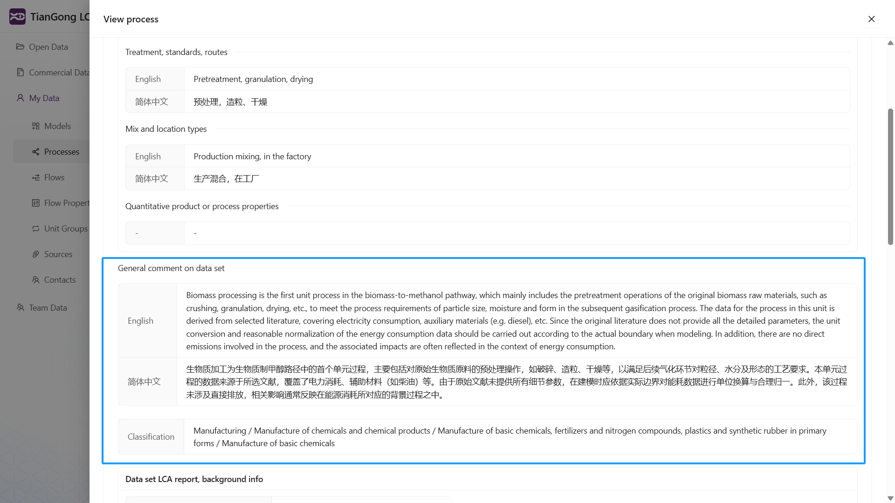

**时间代表性**
参考年份：2020-2023

备注：文献未明确说明数据采集或模拟对应的时间点或时间段。考虑到文章发表于 2024 年，且未涉及未来场景建模，故推定其数据代表性为 2020–2023 年期间的行业平均水平，用于当前工艺的生命周期分析具有适用性。

### 地理代表性

CN（中国）

文献中已明确提出。

### 流程图或工艺图

尽管文献已提供完整的系统边界图，但当前建模仅针对其中的单一过程，因此需从原图中提取该过程对应的部分另行上传，或根据文献描述自行绘制该过程的简化流程图，以便在平台中准确展示其边界与输入输出关系。

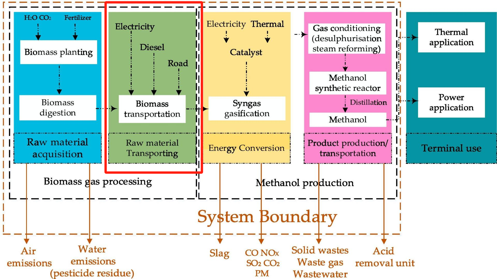

### 建模信息

### LCI方法和分配

数据集类型：单元过程，单一操作

原因在于该过程在数据收集阶段已无法进一步拆分为更细的操作步骤。

使用的数据来源：选取【来源（Sources）】中该篇文献所在文件

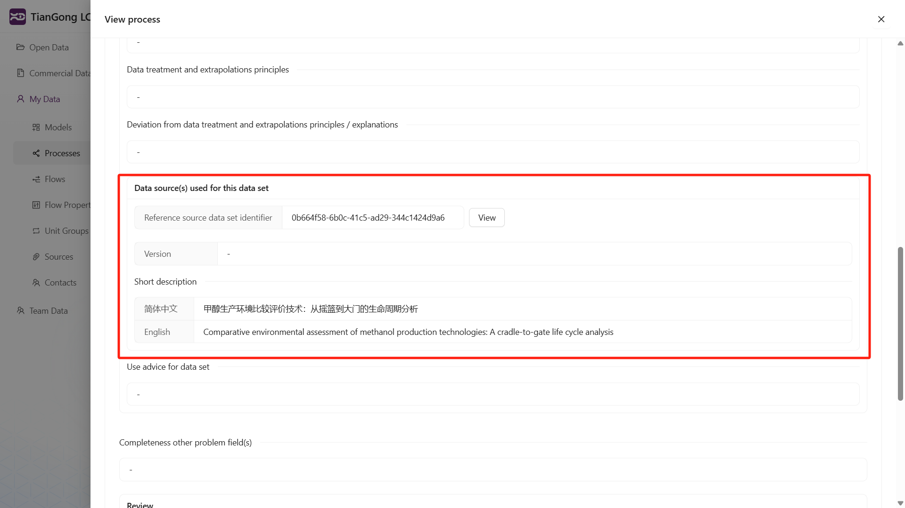

### 管理信息

根据界面显示的模块内容，自行判断并选择引用已有数据源；如无适配项，可不选择。

以下展示数据集收集者/数据集录入人/版本号的填写。

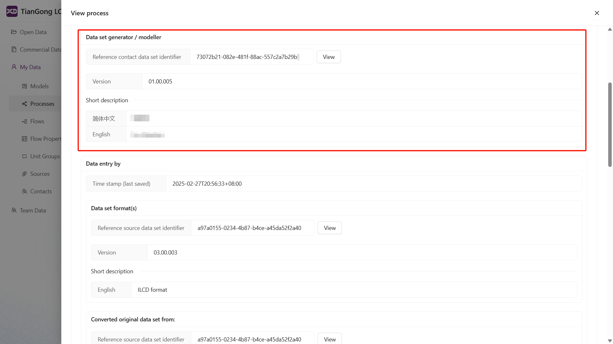

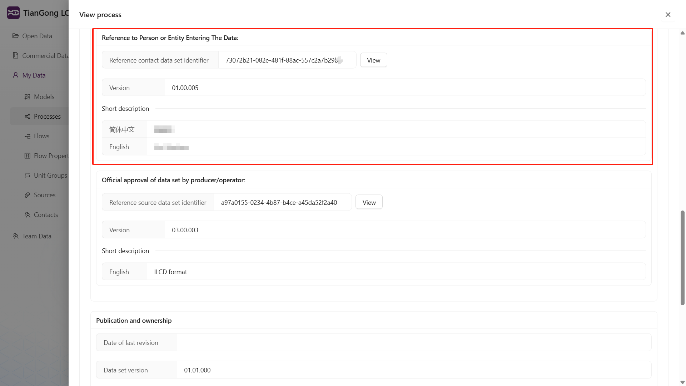

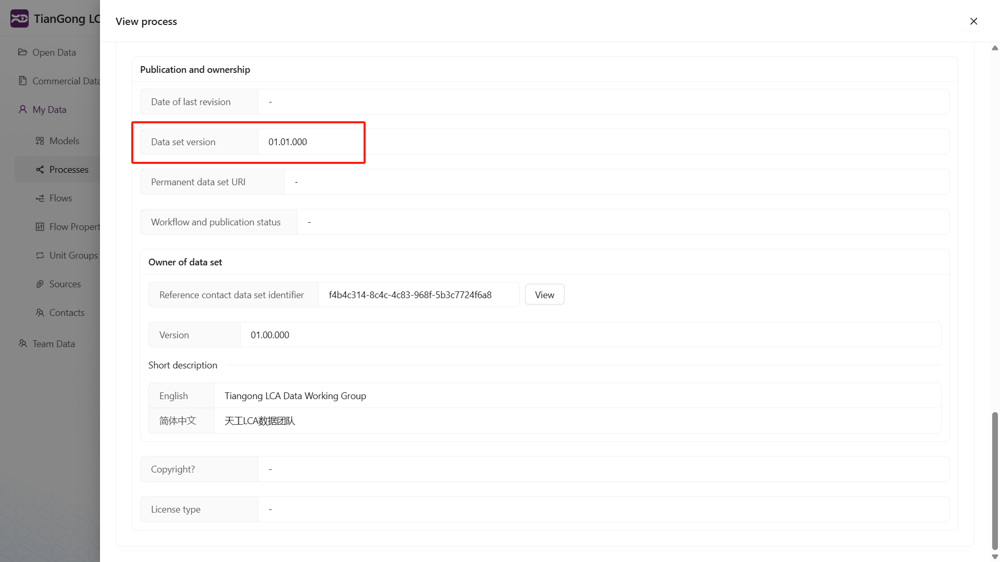

### 输入/输出

根据已确定的参考流及其量值，计算各输入输出项的相对数值，并选择对应的流进行录入，确保数据匹配与单位一致。

【生物质加工】

注意，参考流需要选中量值参考。

【生物质气化】

当前过程存在输入输出**不平衡**，主要原因在于锅炉用水为系统内部循环使用，未作为最终排放计入输出流。需在**备注中予以说明**，以保证物料守恒逻辑清晰。

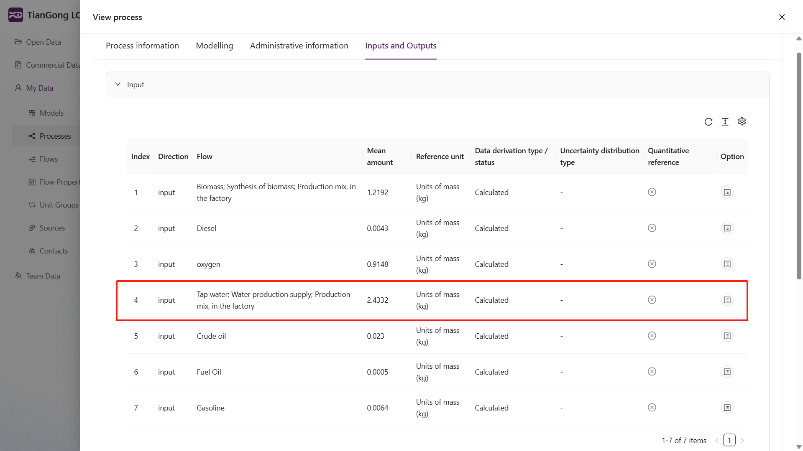

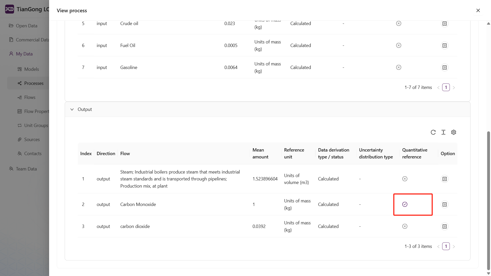

例：<u>锅炉用水在系统中通过闭路循环重复利用（如气化、合成、冷凝回用），输入的水大部分参与内部化学反应与能量传递，最终通过回收纯化重新投入流程，因此输出列表未单独列出水的“消耗”。</u>

---

【甲醇生产】

当前过程存在输入输出不平衡。为满足物料守恒要求，依据输入水量补充设置废水项，作为相应的输出流以平衡整体质量流动。需在备注中予以说明。

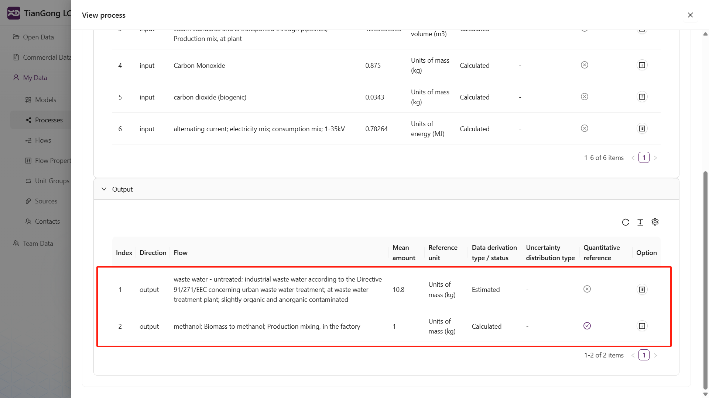

例：<u>考虑物料平衡，基于输入水量添加废水量以修正数据表。</u>

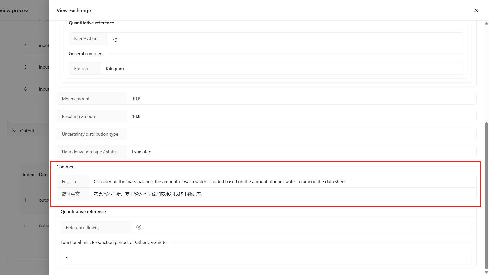

### 新建流

其中【甲醇生产】过程需要新增流：**甲醇；生物质制甲醇；生产混合，在工厂；甲醇质量分数＞99%**

新增的甲醇流名称依据所引用文献中的描述进行确定。

新建流的操作流程见[新建数据-新建流](user-guide/create-my-data.md#新建流)

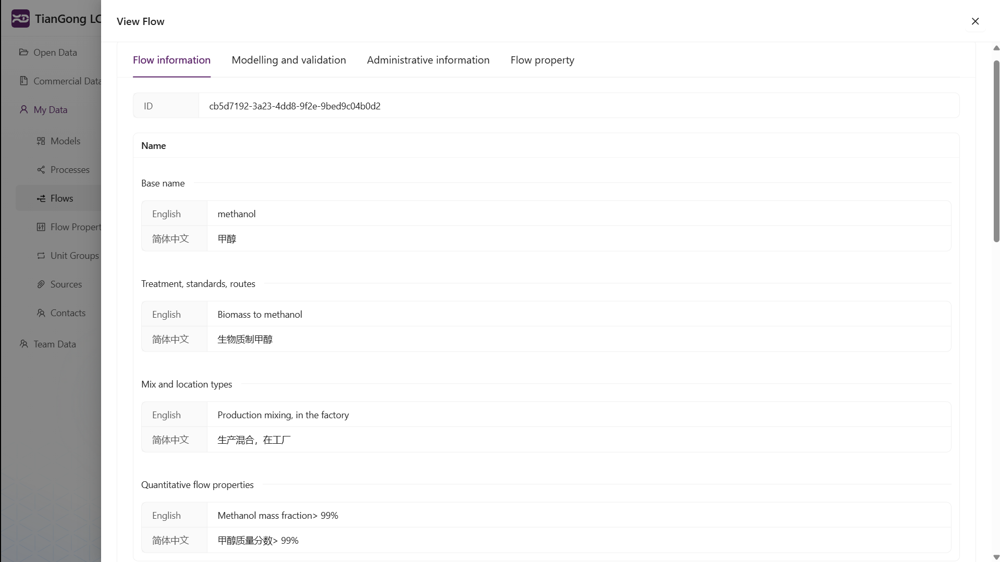

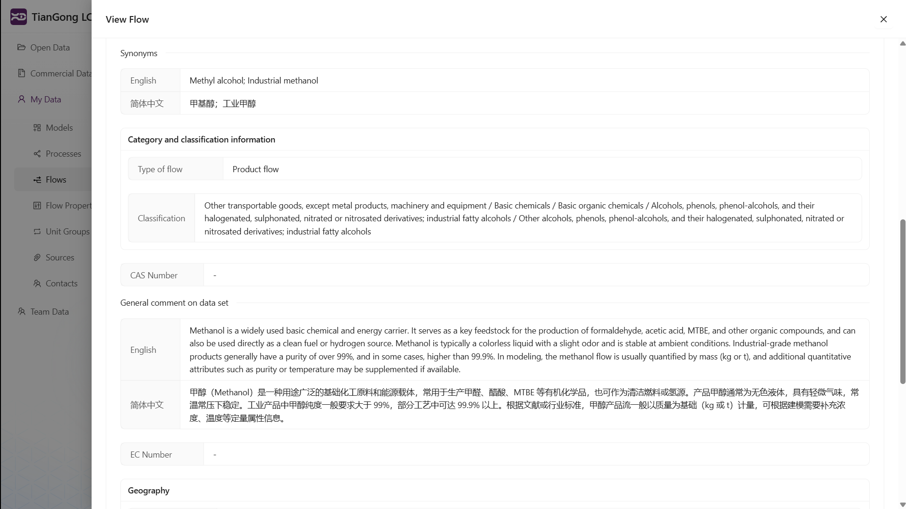

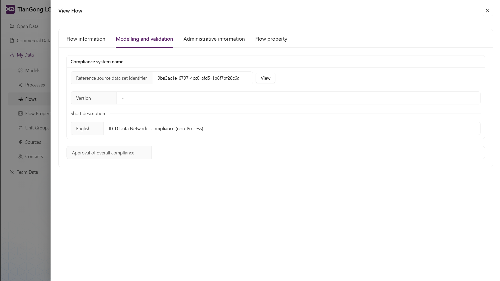

为提升流数据的适用性与完整性，建议在填写流属性时尽量补充多个单位形式。对于甲醇等标准化工产品，可参考其他权威资料或文献，补充如密度、热值等关键参数，从而支持质量、体积、能量等不同建模需求。**并选定其中一个单位为参考量值。**

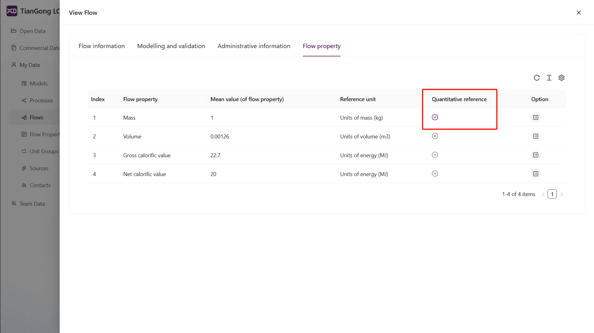

---

## 其他单元过程注意事项

**输入或输出流中不能出现两个相同的流（通过UUID判断），如遇请合并，并备注说明。**

【二氧化碳捕集】

涡轮机用天然气（Natural gas for gas turbine）和煅烧炉用天然气（Natural gas for calciner）的数据需合并。

例：<u>其中，33.33%用于天然气涡轮机，66.67%用于煅烧炉。</u>

