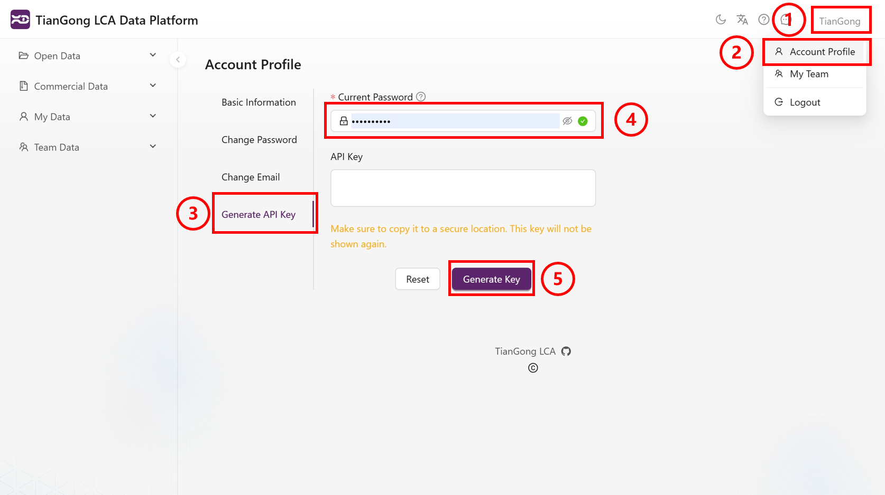
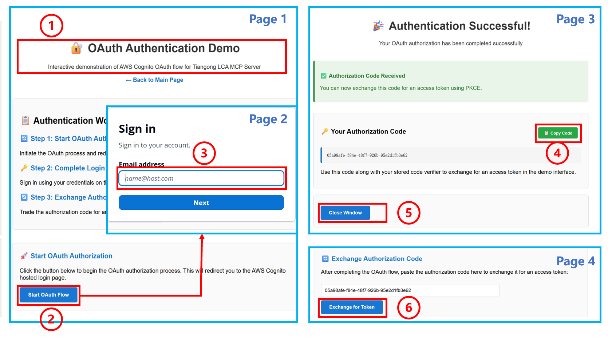
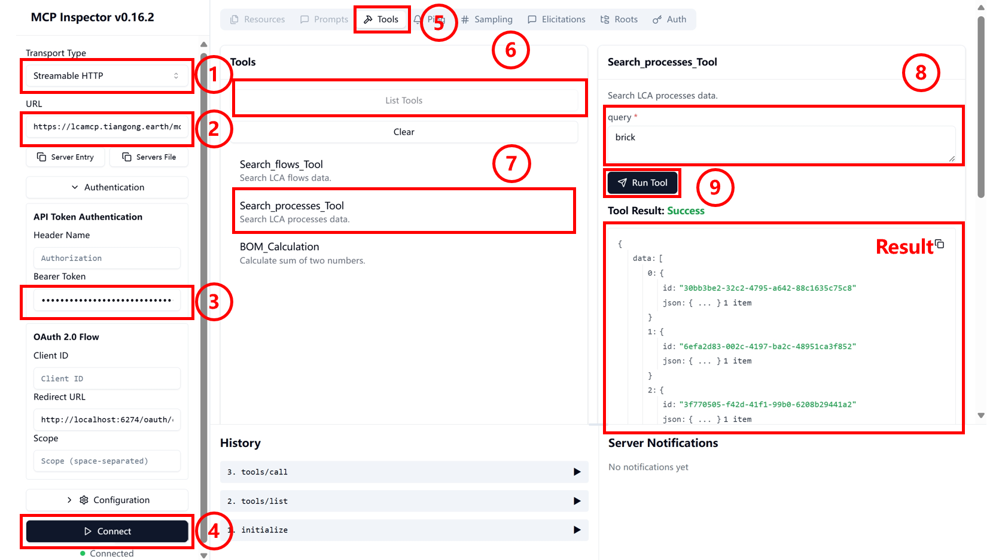
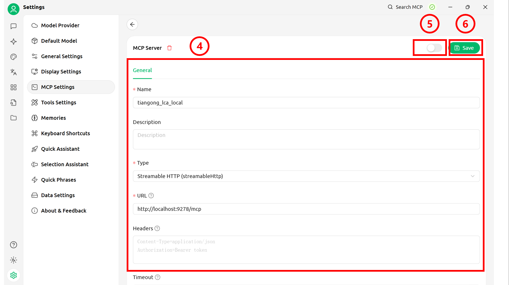

# 天工LCA MCP（远程）

## 远程认证

远程访问需要Bearer token认证，目前，有两种主要方法来获取Bearer token：通过**OAuth 2.0 Flow**和通过**天工生命周期数据平台**

### 天工生命周期数据平台

**登录[天工生命周期数据平台](https://lca.tiangong.earth),用户注册与登录指南详见[官方文档](https://docs.tiangong.earth/quick-start/first-login)，成功打开页面后进行如下操作**  

1. 个人信息展开：点击上边栏右侧个人名称处，浮现出下拉框。
2. 账号信息选择：在下拉框中选择"账号信息"，跳转至账号信息页面。
3. API Key生成：点击右边栏"生成API Key"按钮。
4. 密码验证：在弹出框中输入平台密码进行验证。
5. 密钥获取：点击"生成密钥"按钮，成功获取API Key。



### OAUth 2.0 Flow

1. OAuth界面访问：打开[天工MCP服务器 OAuth Authentication Demo界面](https://lcamcp.tiangong.earth/oauth/demo)。
2. 授权流程启动：下拉页面，找到"Start OAuth Flow"按钮，点击开始授权。
3. 用户登录验证：使用天工生命周期数据平台注册的用户名和密码进行登录。
4. 授权码获取：登录成功后获得Authorization Code，将其复制保存。
5. 窗口关闭：点击"close windows"按钮，返回主界面。
6. 授权码交换：在页面下方将复制的Code粘贴到"Exchange Authorization Code"处，点击"Exchange for tokens"按钮，获取Access token与Refresh token。  
  

## MCP Server的调用

### Inspector

**MCP Inspector启动：在终端输入如下命令，输入后自动跳转至Inspector页面**  

```bash
npx @modelcontextprotocol/inspector
```

1. 传输类型配置：在Inspector页面点击下拉框，选择"Streamable HTTP"。
2. URL地址配置：在url栏填写MCP Server端口地址：[https://lcamcp.tiangong.earth/mcp](https://lcamcp.tiangong.earth/mcp)。
3. 令牌配置：将上述流程获取的Access token或API Key填入相应的token字段。
4. 服务器连接：点击"connect"按钮进行连接。  
**页面连接成功，下面以过程搜索为例展示应用方法**  
5. 工具操作选择：在页面上边栏点击"Tools"按键。
6. 工具列表展开：点击"List Tools"按键，显示下拉工具列表。
7. 搜索工具选择：在列表中点击"Search_processes_Tool"按键。
8. 搜索参数配置：在对应输入框中输入想要搜索的过程关键词。
9. 工具执行运行：点击"Run Tool"按钮运行工具，查看搜索输出结果。



### Cherry studio

1. 设置面板打开：点击侧边栏设置键，打开设置面板。
2. MCP设置访问：选择"MCP Settings"选项，跳转至MCP配置界面。
3. MCP服务器添加：点击右上角"Add Server"按键，跳转至MCP Server配置界面。

    

4. 服务器信息填写：配置远程MCP Server的基本信息（Headers处的XXX为获得的Access token或API Key）。
    >Type:Streamable HTTP  
    >URL:[https://lcamcp.tiangong.earth/mcp](https://lcamcp.tiangong.earth/mcp)  
    >Headers:  
    >Content-Type=application/json  
    >Authorization=Bearer XXX  

5. 配置信息保存：点击"Save"键保存所有设置。
6. MCP连接启动：点击启动按钮打开MCP Server连接。
  
  
7. 聊天界面创建：点击侧边栏最上方按钮，返回主页面。配置模型（参照[官方文档](https://docs.cherry-ai.com/pre-basic/providers)），创建聊天页面。  
8. 服务器连接配置：点击对话框下方的"MCP Settings"按键。
9. MCP服务选择：在弹出的选项中选择需要使用的MCP服务器。  

  
 <video src="img/2.mp4" controls width="600">
  您的浏览器不支持视频播放。
</video>

### Dify

1. 工具页面访问：点击上边栏"Tools"选项，跳转至工具管理页面。  
2. MCP工具搜索：在搜索栏输入"MCP"关键词进行搜索。  
3. 工具市场下载：在Market place中找到并下载MCP工具（图中框选工具为推荐工具）。  
4. 工具安装执行：点击"安装"按钮，完成MCP工具安装。  


5. 配置栏打开：MCP工具安装完成后，点击弹出的配置栏。  
6. 授权配置访问：点击"Authorization"处进行MCP授权配置。  
7. 配置窗口打开：点击后弹出MCP详细配置窗口。  
8. 基本信息填写：在配置窗口中填写必要的连接信息。  
9. 配置信息保存：完成填写后点击"保存"按钮。

  
10. 工作流构建：在Dify中构建工作流或智能体调用MCP。  
>
>1. 智能体、工作流的创建可参照[官方文档](https://docs.dify.ai/zh-hans/guides/application-orchestrate/creating-an-application)。
>2. MCP应用请参照[官方文档](https://docs.dify.ai/zh-hans/guides/tools/mcp)
