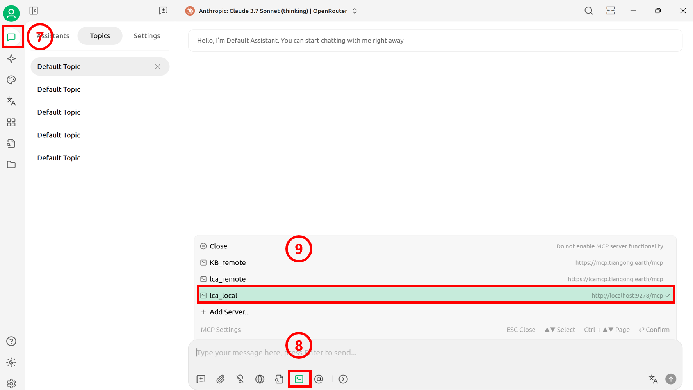
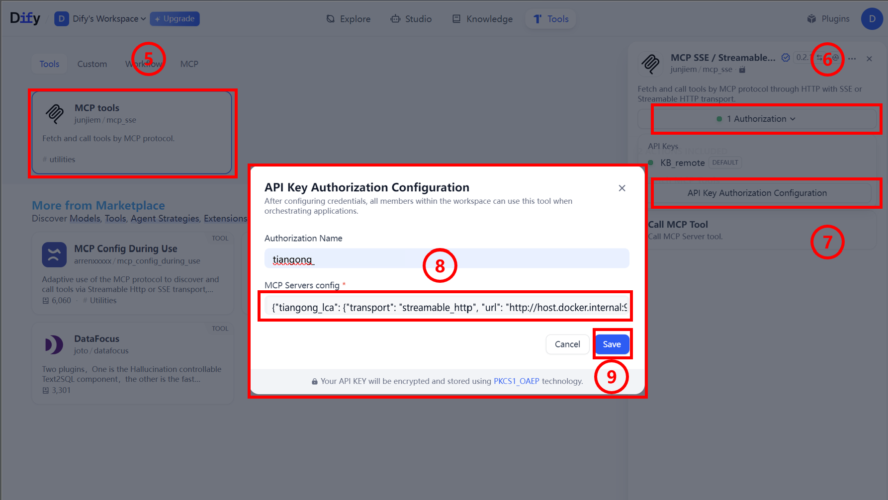

# TianGong LCA MCP(Local)

## OpenLCA Configuration

### OpenLCA Installation

At the [openLCA official website](https://www.openlca.org/download), follow the page instructions to download the openLCA software to your local machine.  

### File Import

Click the software icon to enter the downloaded openLCA interface and begin file import.  

1. Menu Expansion: Click the "File" menu in the upper left corner to expand the dropdown list.  
2. Select Import: In the menu, click the "Import" option to prepare for importing data files.  
3. Import File: In the "Import" submenu, select "File" or "Other" based on the actual data format.

    | Import Option | Purpose                             | Common Supported Formats/Types                                      |
    | :------------ | :--------------------------------- | :------------------------------------------------------------------- |
    | **File**      | Import complete databases or standard dataset files. | `.zolca`, `EcoSpold`, `ILCD`, `SimaPro CSV`, `Excel`   |
    | **Other**     | Import specific components or perform advanced import configuration. | Import entire databases, specific components (processes, flows, methods, etc.), `GeoJSON`, mapping files |

4. Browse Data: After import completion, expand and view data in the main interface navigation bar.  

      

### IPC Server

1. Menu Expansion: Click the "Tools" menu in the upper left corner to expand the dropdown list.  
2. Tool Selection: In the menu, click the "Developer tools" option.  
3. Open Configuration Panel: In the "Developer tools" submenu, select "IPC Server".
4. Port Configuration: Navigate to the "Start an IPC Server" interface, fill in the IPC Server startup port in the Port field (recommended: 8080).  
5. Service Startup: Click the green button to start the IPC Server.  

      

## MCP Server

### NVM Installation

Depending on your system type, download nvm to your local machine from the corresponding official website ([Windows](https://github.com/coreybutler/nvm-windows/releases), [Linux, macOS](https://github.com/nvm-sh/nvm)) following the documentation.  

### Node.js Package

#### Open the corresponding terminal based on your computer's system (Windows/Linux/Mac) and enter the appropriate commands following the instructions below

1. Node.js Download/Activation  

    ```bash
    # Install Node.js version 22
    nvm install 22
    # Configure the Node.js version to use
    nvm use <version>
    ```

2. MCP-Server Package Installation  

    ```bash
    # Install package
    npm install -g @tiangong-lca/mcp-server@0.0.14
    ```

3. MCP-Server Startup  

    ```bash
    # Start MCP-Server
    npx -p @tiangong-lca/mcp-server tiangong-lca-mcp-http-local
    ```

## MCP Server Invocation

### Inspector

### MCP Inspector Launch: Enter the following command in the terminal, which will automatically redirect to the Inspector page

```bash
npx @modelcontextprotocol/inspector
```

1. Transport Type Configuration: On the Inspector page, click the dropdown box and select Streamable HTTP.  
2. URL Configuration: Fill in the MCP Server port [http://localhost:9278/mcp](http://localhost:9278/mcp).  
3. Server Connection: Click connect to establish connection.

    **After successful page connection**, the following demonstrates the application method using environmental impact assessment as an example.  
4. Operation Selection: Click the Tools button on the top toolbar of the page.  
5. List Expansion: Click the List Tools button to display the dropdown list.  
6. Tool Selection: Click the OpenLCA_Impact_Assessment_Tool button.  
7. UUID Configuration: Find the UUID corresponding to systemProcess and impactMethod in openLCA and enter them in the corresponding boxes.  
8. Tool Execution: Click Run Tool to execute the tool and display output.  

    

### Cherry Studio

At the [Cherry Studio official website](https://www.cherry-ai.com/download), follow the [official documentation](https://docs.cherry-ai.com/pre-basic/installation) to download the software to your local machine and open it.

1. Open Settings Panel: Click the settings button in the sidebar to open the panel.  
2. Open MCP Settings: Select MCP Settings to navigate to the MCP configuration interface.  
3. Add MCP Server: Click the Add Server button in the upper right corner to navigate to the MCP Server configuration interface.  

    

4. Information Filling: Configure basic information for the local MCP Server.

    >Type: Streamable HTTP  
    >URL: [http://localhost:9278/mcp](http://localhost:9278/mcp)

5. Save Information: Click the "Save" button to save settings.
6. Start MCP Connection: Click to open the MCP Server.

      
7. Open Chat Interface: Click the top button in the sidebar to return to the main page. Configure the model (refer to [official documentation](https://docs.cherry-ai.com/pre-basic/providers)) and create a chat page.  
8. Server Connection: Click the MCP Settings button below the conversation.  
9. MCP Selection: Select the required MCP.  

      

    <video src="img/1.mp4" controls style={{width: '100%', maxWidth: '10000px'}}>
      Your browser does not support video playback.
    </video>

### Dify

Based on the [official Dify documentation](https://docs.dify.ai/zh-hans/getting-started/install-self-hosted/readme), deploy it locally. After the deployment is complete and the project is running, perform the following steps.

1. Tools Page Access: Click the "Tools" option in the top toolbar to navigate to the tool management page.  
1. MCP Tool Search: Enter "MCP" keyword in the search bar to search.  
1. Tool Market Download: Find and download the MCP tool in the Market place (the highlighted tool in the figure is the recommended tool).  
1. Tool Installation Execution: Click the "Install" button to complete MCP tool installation.  

    

1. Configuration Panel Opening: After MCP tool installation is complete, click the pop-up configuration panel.  
1. Authorization Configuration Access: Click "Authorization" to configure MCP authorization.  
1. Configuration Window Opening: Click to open the MCP detailed configuration window.  
1. Basic Information Filling: Fill in necessary connection information in the configuration window.  

    ```JSON
    {
      "tiangong_lca_remote": {
        "transport": "streamable_http",
        "url": "http://host.docker.internal:9278/mcp  ",
        "headers": {
          "Accept": "application/json,text/event-stream",
        },
        "timeout": 50,
        "sse_read_timeout": 50
      }
    }
    ```

1. Configuration Information Saving: Click the "Save" button after completing the form.  

      

1. Workflow Construction: Build workflows or agents in Dify to invoke MCP.  
    >
    >1. For creating agents and workflows, refer to [official documentation](https://docs.dify.ai/zh-hans/guides/application-orchestrate/creating-an-application).
    >2. For MCP applications, refer to [official documentation](https://docs.dify.ai/zh-hans/guides/tools/mcp)
