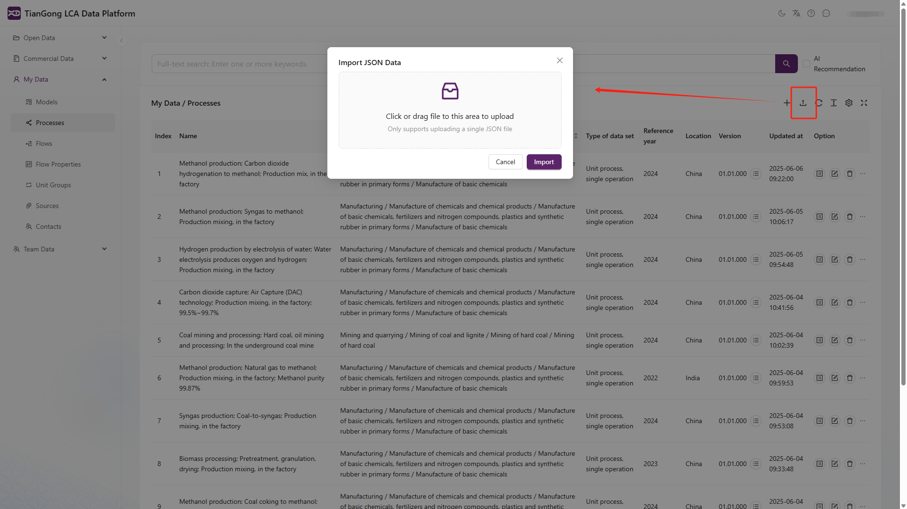

# Key Functions Introduction

This section helps you understand the specific functions and usage of various buttons in the platform interface, enabling efficient operation and management of lifecycle assessment data.

## Main Interface Top-Right Buttons

The top-right corner of the main interface contains the following function buttons:

### ① Day/Night Mode Toggle

### ② Language Switch

### ③ Platform Documentation Access

Click the question mark icon to navigate to the TianGong platform documentation page, where users can find detailed usage instructions and FAQs.

### ④ Platform Notifications

## Public Data Interface Buttons

### ⑤ Page Refresh

### ⑥ Display Density Adjustment

Supports three density modes: Comfortable, Medium, and Compact to accommodate different screens and preferences. Default is Medium.

### ⑦ Column Settings - Select Displayed Columns

Filterable columns include: ID, Name, Category, Version, Update Time, Actions. Click Reset to restore default settings.

### ⑧ Fullscreen Mode

Click to enter fullscreen view: hides left navigation, collapses search bar, and maximizes data table area.

Fullscreen mode with filterable columns:

### ⑨ View All Versions

### ⑩ View Data Details (Read-only)

View complete data content and structure without editing capability.

### ⑪ Duplicate Function

Quickly create a copy of the data item for rapid modeling or modification based on existing data.

### ⑫ Data Export

Export the data item as a standard .json file for offline backup, local analysis, or cross-system integration.

⚠️ Export format is standard .json file with platform-compatible structure.

## My Data Interface Buttons

Excluding buttons with identical functions, below are unique features in the My Data interface.

### ⑬ Add New Data Item

### ⑭ Data Import

Supports standardized .json files. The system automatically parses content and matches fields.

### ⑮ Edit Information

### ⑯ Contribute to Team

⚠️ Current version only supports importing JSON files that comply with TIDAS structure standards without nested errors.

